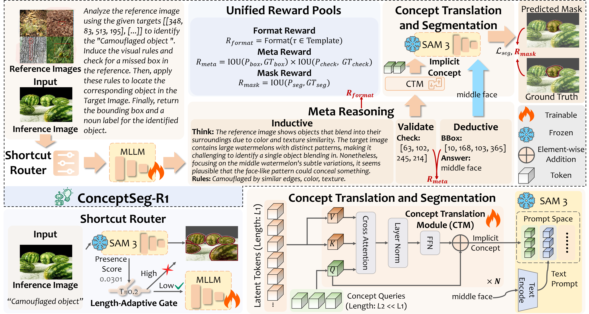
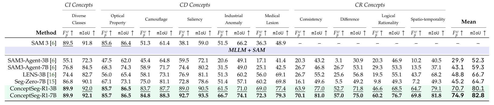
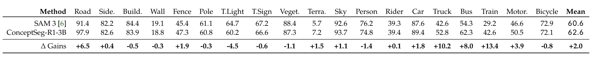
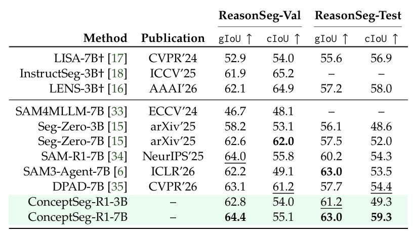
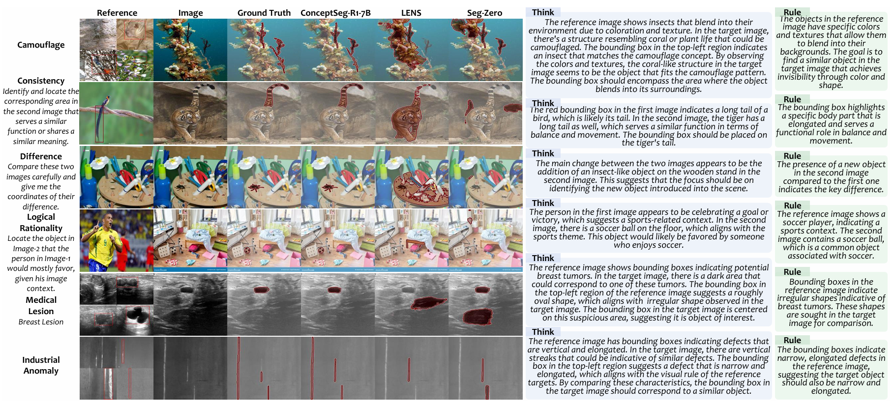
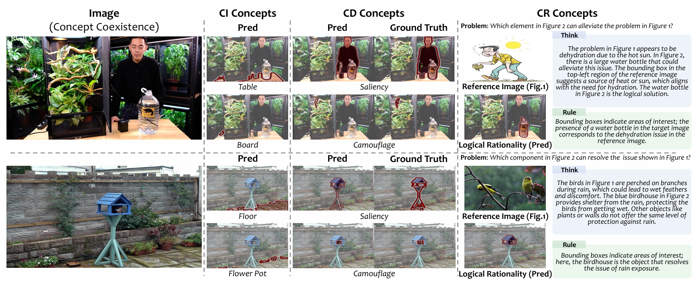

<div align="center">

<h1>ConceptSeg-R1</h1>

**ConceptSeg-R1: Segment Any Concept via Meta-Reinforcement Learning**

[](https://arxiv.org)
[](https://ntu-ai4x.github.io/ConceptSeg-R1/)
[](https://huggingface.co/zhaoyuan666/ConceptSeg-R1-7B)
[](https://huggingface.co/datasets/zhaoyuan666/ConceptSeg-Benchmark)
[](LICENSE)
[](https://github.com/yuanzhao-CVLAB/ConceptSeg-R1/stargazers)

<p>
  <a href="#introduction">Introduction</a> •
  <a href="#get-started">Get Started</a> •
  <a href="#data">Data</a> •
  <a href="#datasets--checkpoints">Checkpoints</a>
</p>


</div>

## 🎬 Short Video
<a href="https://ntu-ai4x.github.io/ConceptSeg-R1/#Show">
  
</a>

## 📰 News

- **May 2026** — arXiv paper released 🎉

## 🗺️ Roadmap

| Status | Item |
|:------:|------|
| ✅ | arXiv paper |
| ✅ | Training code |
| ✅ | Testing code |
| ✅ | CI-CD-CR datasets |
| ✅ | ConceptSeg-R1 (7B weights) |
| ⬜ | Support larger MLLM backbones, e.g., Gemini 2.5 Pro|


## Introduction

<div align="center">

### 🌍 As segmentation in computer vision shifts from objects to concepts, 
### 🚀 **ConceptSeg-R1 takes the first step toward segmenting any concept.**

</div>

<div align="center">

</div>

<br>

### Key Contributions
- **🌳 From Objects to Concepts**  
  We introduce a three-level concept hierarchy covering **CI**, **CD**, and **CR** concepts, pushing segmentation beyond category recognition.

- **🔁 From Instance Solving to Rule Induction**  
  Meta-GRPO enables the model to infer transferable task rules from visual demonstrations and apply them deductively to unseen queries.

- **🔗 Latent Concept Tokens for Frozen SAM 3**  
  We map MLLM reasoning states into implicit concept tokens in the SAM 3 prompt space, enabling reasoning-aware segmentation without fine-tuning SAM 3.

- **⚡ From Heavy Reasoning to Adaptive Inference**  
  The Shortcut Router dynamically balances SAM 3 efficiency and reasoning depth, enabling fast perception for simple cases and deeper reasoning for complex concepts.

## Results

### Concept Segmentation Benchmarks (CI / CD / CR)

<div align="center">

</div>
<br>

### Cityscapes Performance (Zero-Shot)


<div align="center">

</div>
<br>

### ReasonSeg Performance (Zero-Shot)


<div align="center">

</div>

### Qualitative Comparison

<div align="center">

</div>
<br>

### Concept Coexistence


<div align="center">

</div>
<br>

## Get Started

### 1. Environment Setup

Before running `setup.sh`, download the release assets below from
[GitHub Releases](https://github.com/yuanzhao-CVLAB/ConceptSeg-R1/releases)
and place them in the repository root:

- `sam3-main.zip`: the modified SAM 3 package used by ConceptSeg-R1.
- `all_meta.json.zip`: the training metadata file.

```bash
conda create -n conceptseg-r1 python=3.10
conda activate conceptseg-r1
bash setup.sh
```

### 2. Training

**Prepare data** — Download the dataset, extract `all_meta.json` through `setup.sh`,
and set your `image_folders` path in the shell scripts.

```bash
# Stage 1: SFT Training
bash run_grpo_multiimage_stage1.sh

# Stage 2: GRPO Training
bash run_grpo_multiimage_stage2.sh
```

### 3. Evaluation

**Concept Segmentation** — Download weights, set the model path in `eval_conceptseg.sh`, then run:

```bash
bash eval_conceptseg.sh
```

> **Tip:** Configure specific tasks for testing inside `eval_conceptseg.sh`.

**Reasoning Segmentation** — Download weights, set the model path in `eval_reasonseg.sh`, then run:

```bash
bash eval_reasonseg.sh
```

## Data

`all_meta.json` is no longer tracked in this repository. Download
`all_meta.json.zip` from
[GitHub Releases](https://github.com/yuanzhao-CVLAB/ConceptSeg-R1/releases)
and run `bash setup.sh` to extract it before training.

Place datasets under a shared root directory (`image_folders`):

```
root/
├── isic2018/
├── rare/
├── Breast_Tumor/
├── transparent1024/
├── MGrounding-630k/
├── Polyp/
├── Shadow_detection/
├── MIG-Bench/
├── coco2014_Living/
├── CoSOD3k1024/
├── ultra_rare/
├── coco2014_Artifact/
├── fewshot1000/
├── DUTS/
├── ESDIDefects/
└── COD10K1024/
```


## Metric

Evaluation uses the [PySegMetric_EvalToolkit](https://github.com/Xiaoqi-Zhao-DLUT/PySegMetric_EvalToolkit).


## Datasets & Checkpoints

| Resource | Link |
|----------|------|
| 📦 ConceptSeg-Benchmark Dataset | [Download on HuggingFace](https://huggingface.co/datasets/zhaoyuan666/ConceptSeg-Benchmark) |
| 🤖 ConceptSeg-R1-7B Weights | [Download on HuggingFace](https://huggingface.co/zhaoyuan666/ConceptSeg-R1-7B) |
